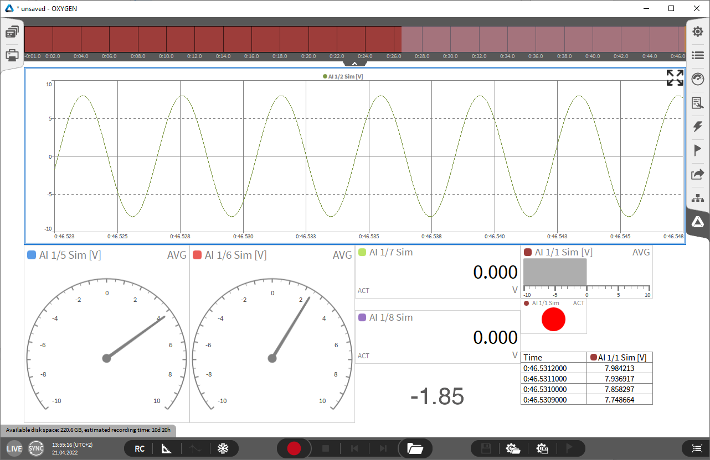
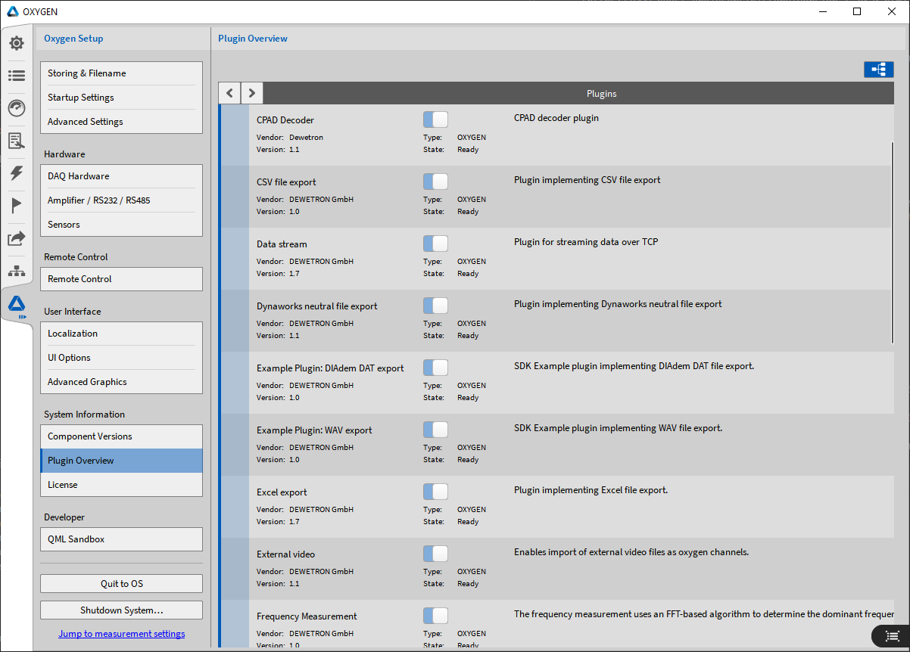

Introduction
============

The Oxygen Software Development Kit (also called Oxygen SDK or ODK) allows
the extension of the Oxygen measurement application using external plugins.

This documentation describes plugin development for the
DEWETRON Oxygen measurement software using the OxygenSDK (ODK).
More detailed information about Oxygen and the latest installer can be found
at

https://www.dewetron.com/products/oxygen-measurement-software/

    Oxygen application

Oxygen Plugins
--------------

The ODK plugin mechanism is used by a large number of Oxygen
plugins. Please have look into *System Setup/Plugin Overview* to get a overview:

    Oxygen plugins

Oxygen SDK
----------

Oxygen SDK is hosted on GitHub and freely accessable:

https://github.com/DEWETRON/OXYGEN-SDK

Please clone the repository to get the necessary source code.

Alternatively it is possible to download the latest
Oxygen SDK Release:

https://github.com/DEWETRON/OXYGEN-SDK/releases

Supported Programming Languages
-------------------------------

Well the title for this section is a little bit misleading. There is only
one option:

 * C++

All UI elements are using the qt framework and the QML markup language.

Supported Operating Systems
---------------------------

Following operating systems are supported by Oxygen:

 * Microsoft Windows 7,10,11 (64bit)
 * Ubuntu 20.04 LTS Linux (Focal Fossa)
 * Red Hat Enterprise Linux 8 (RHEL8)

Compatible (and free) alternatives to RHEL8 are:

 * Rocky Linux 8
 * AlmaLinux 8
 * Oracle Linux 8

Supported Development Environments
----------------------------------

Microsoft Windows
~~~~~~~~~~~~~~~~~

CMake (https://cmake.org/)

Microsoft Visual Studio 2019 or better

Ubuntu Linux
~~~~~~~~~~~~

CMake

GCC Gnu Compiler Collection

Make

Red Hat Linux
~~~~~~~~~~~~~

CMake

GCC Gnu Compiler Collection

Make

**An IDE working for all listed Operating Systems would be:**

Microsoft Visual Studio Code with the extensions:

  - C/C++ Extension Pack
  - CMake Tools

ODK structure
-------------

\/odk/uni

  Contains some low-level utility functions to work with strings,
  xml and UUIDs.

\/odk/base

  Basic data structures that are used for communication between a host
  application and its plugins.

\/odk/api

  The actual interface for Oxygen and Oxygen plugins. Describes messages
  that may be used in both directions and queries to read system information
  from Oxygen. Since some complex commands use XML parameters this
  library also includes (de-)serialization classes for most of them.

  These are still low level commands that should only be used directly if
  some task cannot be solved using the framework functionality.

\/odk/framework

  This library contains support classes that make plugin development
  much easier.

  The base classes, such as :ref:`Software Channel Plugin <software_channel_plugin>`, are tailored for common
  types of plugins and implement basic tasks in order to allow the
  plugin developer to focus on the new functionality.

  Additional helper objects simplify reading input data or exposing
  config items.

\/:ref:`Examples <examples>`

  Source code for several small plugins is provided here to demonstrate
  different scenarios for using the ODK framework.

\/3rdparty

  Contains the source code of third party libraries that are required
  to build the SDK projects.

  pugixml is a fast XML parser for C++ and included on GitHub.

  ODK also requires some parts of the Boost C++ libraries which should
  be extracted to this directory.
  Check out the
  :ref:`Build Instructions <build_instructions>`
  for details.

\/docs

  ODK documentation source files

