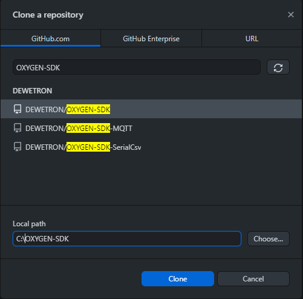
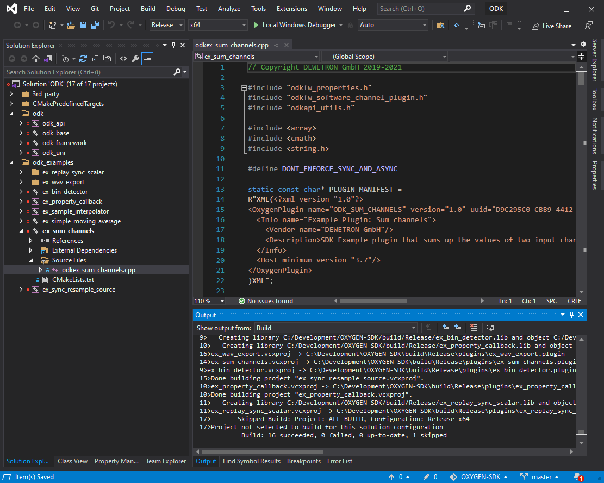
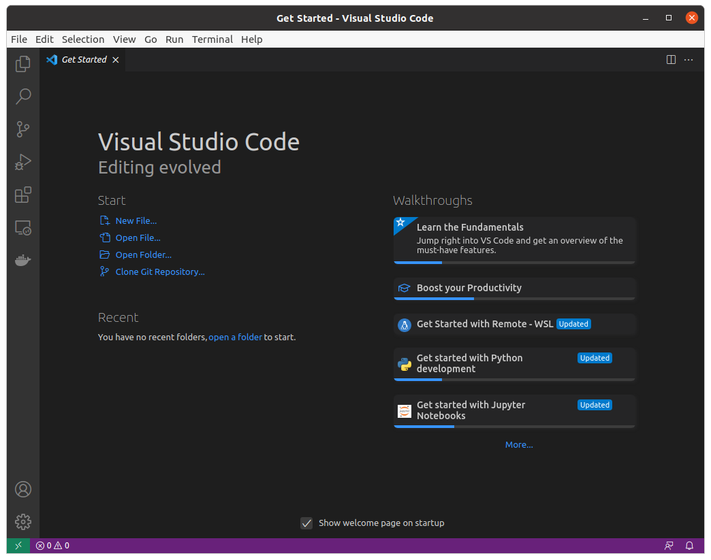
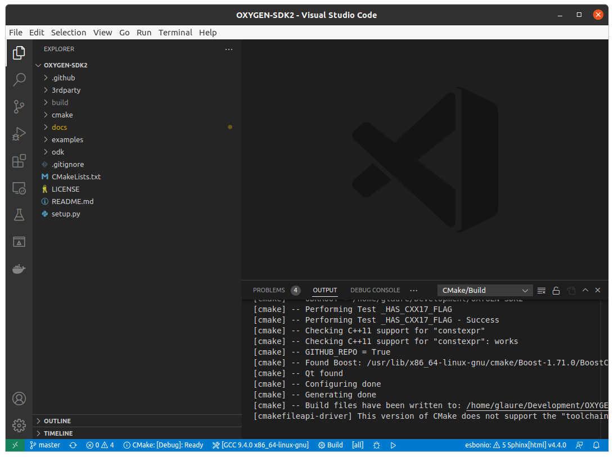
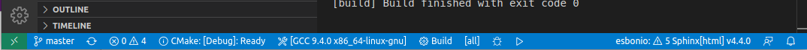
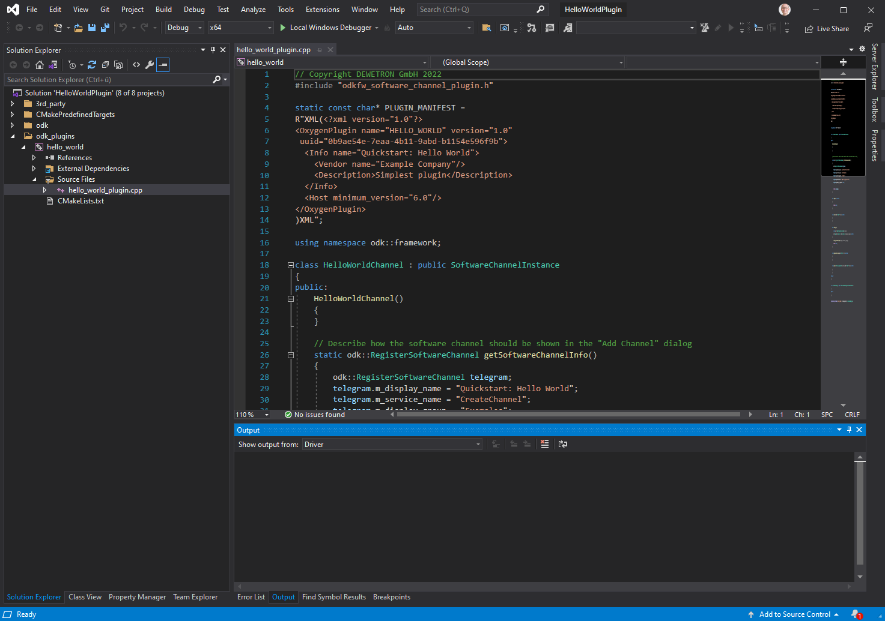
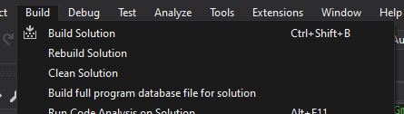
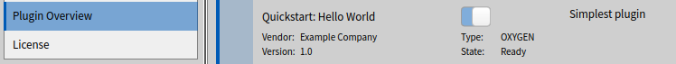
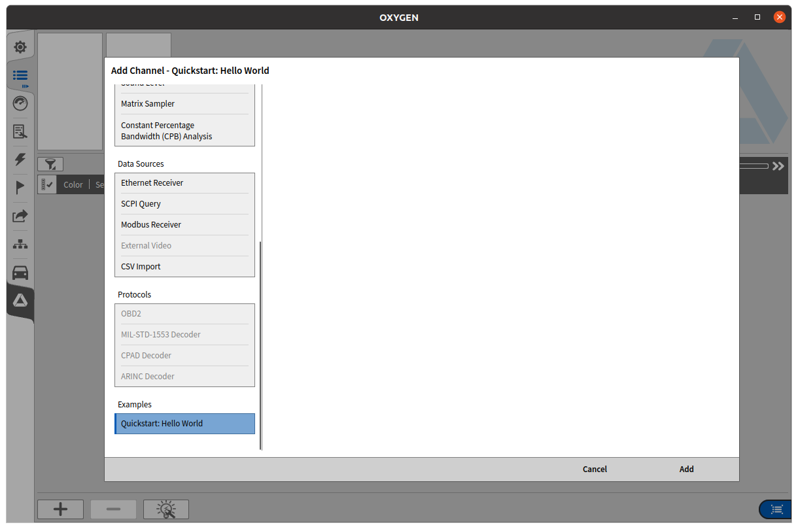

.. _quickstart:

Quickstart
==========

This quickstart guide will guide you through the necessary steps for building
Oxygen plugins.

The guide explains three necessary steps:

1. Setup of a development environment
2. Compiling OXYGEN-SDK
3. A new plugin: Hello World

Lets start with the setup of the development environment:

- Visual Studio 2019 or better (for Windows)
- cmake
- Oxygen

A free alternative to Visual Studio 2019/2022 is *Visual Studio Code*.

Install Oxygen
--------------

To test the plugins, an Oxygen installation is needed:

Please download and install the latest Oxygen installer from DEWETRON's
download portal:

https://www.dewetron.com/products/oxygen-measurement-software/

Development Requirements for Windows
------------------------------------

- Microsoft Visual Studio 2019 or later with C++ compiler and toolchain (https://visualstudio.microsoft.com/)
- CMake (https://cmake.org/download/)
- Git for windows or https://desktop.github.com/ application

Make sure Visual Studio and CMake are installed.
Please verify that the ``cmake`` command can be run from the command prompt.
If this does not work you have use the 'Add CMake to the system PATH' option
during installation or add it to the PATH manually.

.. code:: text

   C:\> cmake --version
   cmake version 3.16.4

   CMake suite maintained and supported by Kitware (kitware.com/cmake).

Optional Requirements
---------------------

For resource package creation the qt resource compiler (rcc) is needed.

It is found the GitHub projects download section:

https://github.com/DEWETRON/OXYGEN-SDK/releases/download/OXYGEN-SDK-6.0.0/qt_resource_compiler.zip

Alternatively one can install the complete Qt libraries package:

- Qt 5.15.2 (https://www.qt.io/download-qt-installer)

Qt is a rather large download (40GB with included debug symbol files) so
the use of the small provided qt_resource_compiler.zip archive is preferred.

In order to build and execute unit tests, `Boost C++ Libraries 1.70 <https://www.boost.org/users/history/version_1_70_0.html>`__ or later are needed.

Development Requirements for Linux
----------------------------------

- Ubuntu 20.04 LTS Linux (Focal Fossa)
- Red Hat Enterprise Linux 8 (RHEL8)

The minimum build environment for Linux consists of following packages:

- cmake
- gcc/g++
- qt-dev
- make
- boost (optional)
- ninja (optional)

It is completely ok to use the packages provided by the distribution.

Optional Requirements for Linux
-------------------------------

A good and free IDE for Linux (and Windows too) is Visual Studio Code.
The download is free and its usage is highly recommended.

https://code.visualstudio.com/download

In addition, to build and execute unit tests, the boost-test development packages are needed.

.. _build_instructions:

Build instructions for Windows
------------------------------

It is assumed that https://github.com/DEWETRON/OXYGEN-SDK is cloned
to this directory: C:\\OXYGEN-SDK.

Alternatively you can download a zip archive:

https://github.com/DEWETRON/OXYGEN-SDK/archive/refs/heads/master.zip

Git clone using cmd.exe
~~~~~~~~~~~~~~~~~~~~~~~

.. code:: text

   C:\> cd C:\
   C:\> git clone https://github.com/DEWETRON/OXYGEN-SDK.git OXYGEN-SDK

Git clone using GitHub Desktop
~~~~~~~~~~~~~~~~~~~~~~~~~~~~~~

    Cloning with GitHub Desktop

Easy workspace setup using setup.py (Optional)
~~~~~~~~~~~~~~~~~~~~~~~~~~~~~~~~~~~~~~~~~~~~~~

``C:\OXYGEN-SDK\setup.py`` is a utility script automating the following steps.
It downloads and setups all 3rdparty tools and libraries:

* Boost 1.70.0
* CMake
* Qt resource compiler

setup.py needs python3 to be installed. Using setup.py is completely optional: All the
steps necessary can be done manually.

.. code:: text

   C:\> cd C:\OXYGEN-SDK
   C:\> python setup.py
   Boost 1.70.0 dependency processing ...
   Qt resource compiler (rcc) dependency processing ...
   CMake 3.23.1 dependency is fullfilled!

When using setup.py *Workspace setup step by step* can be skipped.

Workspace setup step by step
~~~~~~~~~~~~~~~~~~~~~~~~~~~~

Setup Boost libraries
^^^^^^^^^^^^^^^^^^^^^
*If setup.py was not used or did not succeed*

Extract the Boost source archive to ``C:\OXYGEN-SDK\3rdparty``.

Verify that the file
``C:\OXYGEN-SDK\3rdparty\boost_1_70_0\boost\align.hpp`` exists
to make sure the extracted paths are correct.

Setup Qt resource compiler
^^^^^^^^^^^^^^^^^^^^^^^^^^
*If setup.py was not used or did not succeed*

Unpack ``qt_resource_compiler.zip`` to ``C:\OXYGEN-SDK``

*Or: Qt 5.15.2 has to be installed on the system.
This manual assumes the correct build for your compiler is installed to {QT_DIR}
(for example C:\\Qt\\5.15.2\\msvc2017_64)*

Building with Visual Studio
~~~~~~~~~~~~~~~~~~~~~~~~~~~

Open a command line prompt and change to the directory ``C:\OXYGEN-SDK``

Create a new directory ``build`` and change to ``C:\OXYGEN-SDK\build``

.. code:: text

   C:\> cd C:\OXYGEN-SDK
   C:\OXYGEN-SDK> mkdir build
   C:\OXYGEN-SDK> cd build

Using cmake we create a Visual Studio solution:

.. code:: text

   C:\OXYGEN-SDK\build> cmake -A x64 ..

The option *-A x64* forces the solution to build for 64bit architecture.
It may not be necessary, but sometimes a x86 (32bit) solution is created
and Oxygen is not able to load the plugins.

If your are using a qt installation instead of the qt_resource_compiler package please call cmake like this:

.. code:: text

   C:\OXYGEN-SDK\build> cmake -A x64 -DCMAKE_PREFIX_PATH={QT_DIR} ..

If CMake encounters an error, you need to fix the issue and then invoke

.. code:: text

   C:\OXYGEN-SDK\build> del CMakeCache.txt

before retrying to ensure a clean run.

Open the generated Solution in Visual Studio

.. code:: text

   C:\OXYGEN-SDK\build> start ODK.sln

    Visual Studio 2019 ODK solution

Build at least one of the example plugins. *Build Solution* will build everything.

The compiled plugins will be stored in
``C:\OXYGEN-SDK\build\{Debug|Release}\plugins``
as files with the extension .plugin

To test a plugin it has to be copied to ``{PublicDocuments}\Dewetron\Oxygen\Plugins``
or the 'bin' directory of the installed Oxygen (by default this is
``C:\Program Files\DEWETRON\Oxygen\bin)``.

Start Oxygen and the plugin will automatically load.

This can be verified by looking at
'System Settings' -> 'Extensions and Plugins' -> 'Overview'

.. attention:: Oxygen is a 64bit application (x64) and is not able to load plugins build for a 32bit (x86) architecture.
  Please check the build configuration in Visual Studio if your plugin fails to load. Add ``-A x64`` to the cmake call.

Build instructions for Linux
----------------------------

It is assumed that https://github.com/DEWETRON/OXYGEN-SDK is cloned
to the directory referred to as WORKSPACE:

.. code:: text

   PC$ cd $HOME
   PC$ git clone https://github.com/DEWETRON/OXYGEN-SDK.git OXYGEN-SDK

The directory ``/home/USER/OXYGEN-SDK`` has been created containing the latest
SDK version.

Building with commandline tools
~~~~~~~~~~~~~~~~~~~~~~~~~~~~~~~

Enter the OXYGEN-SDK directory and execute cmake to check for all necessary
dependencies and let it create a Makefile.

.. code:: text

   PC$ cd $HOME/OXYGEN-SDK
   PC$ mkdir build
   PC$ cd build
   PC$ cmake ..
   -- The C compiler identification is GNU 9.4.0
   -- The CXX compiler identification is GNU 9.4.0
   -- Check for working C compiler: /usr/bin/cc
   -- Check for working C compiler: /usr/bin/cc -- works
   -- Detecting C compiler ABI info
   -- Detecting C compiler ABI info - done
   -- Detecting C compile features
   -- Detecting C compile features - done
   -- Check for working CXX compiler: /usr/bin/c++
   -- Check for working CXX compiler: /usr/bin/c++ -- works
   -- Detecting CXX compiler ABI info
   -- Detecting CXX compiler ABI info - done
   -- Detecting CXX compile features
   -- Detecting CXX compile features - done
   -- ODKROOT = /home/USER/OXYGEN-SDK
   -- Performing Test _HAS_CXX17_FLAG
   -- Performing Test _HAS_CXX17_FLAG - Success
   -- Checking C++11 support for "constexpr"
   -- Checking C++11 support for "constexpr": works
   -- GITHUB_REPO = True
   -- Found Boost: /usr/lib/x86_64-linux-gnu/cmake/Boost-1.71.0/BoostConfig.cmake (found version "1.71.0")
   -- Qt found
   -- Configuring done
   -- Generating done
   -- Build files have been written to: /home/USER/OXYGEN-SDK/build

Now run make to build the SDK and all example plugins

.. code:: text

   PC$ make
   Scanning dependencies of target pugixml
   [  1%] Building CXX object 3rdparty/pugixml-1.9/CMakeFiles/pugixml.dir/__/src/pugixml.cpp.o
   [  2%] Linking CXX static library ../../Debug/libpugixml.a

   lines skipped

   [ 98%] Linking CXX shared library ../../Debug/plugins/libex_wav_export.plugin
   [100%] Built target ex_wav_export

After building all plugins are found here:

*Debug*: OXYGEN-SDK/build/Debug/plugins/

*Release*: OXYGEN-SDK/build/Release/plugins/

.. code:: text

   PC$ ls build/Debug/plugins/
   libex_bin_detector.plugin
   libex_property_callback.plugin
   libex_replay_sync_scalar.plugin
   libex_sample_interpolator.plugin
   libex_simple_moving_average.plugin
   libex_sum_channels.plugin
   libex_sync_resample_source.plugin
   libex_wav_export.plugin

Building with Visual Studio Code
~~~~~~~~~~~~~~~~~~~~~~~~~~~~~~~~

It is highly suggested that following Visual Studio Code extensions have been installed:

- C/C++
- CMake Tools
- alternatively: C/C++ Extension Pack

*Please note that Visual Studio Code is also a good working IDE for Windows.*

Start Visual Studio Code

    Visual Studio Code

Select *Open Folder* and select ``/home/USER/OXYGEN-SDK``. On the first start
Visual Studio Code asks which compiler (or Kit) to use.
Select 9.3 or 9.4, both work great.

.. note:: Most modern compilers will work, as far as C++ 17 is supported.

Usually cmake is automatically run by the IDE.

    Visual Studio Code after cmake

Press *Build* in the bottom bar to trigger the compilation of the Oxygen-SDK framework
and all example plugins.
There is also the option to switch between Release and Debug build.

    Visual Studio Code Building

After building all plugins are found here:

*Debug*: OXYGEN-SDK/build/Debug/plugins/

*Release*: OXYGEN-SDK/build/Release/plugins/

.. code:: text

   PC$ ls build/Debug/plugins/
   libex_bin_detector.plugin
   libex_property_callback.plugin
   libex_replay_sync_scalar.plugin
   libex_sample_interpolator.plugin
   libex_simple_moving_average.plugin
   libex_sum_channels.plugin
   libex_sync_resample_source.plugin
   libex_wav_export.plugin

Hello World plugin
------------------

The first plugin will be a variant of the classic "Hello World" programming
example.

To start the development a project directory for our new development has to
be created: ``C:\OXYGEN-PLUGINS\Hello_World``

Our plugin directory has to be populated with at least two files:

- The plugin source file: hello_world_plugin.cpp
- The plugin build file: CMakeLists.txt

Hello World Source Files
~~~~~~~~~~~~~~~~~~~~~~~~

Lets start with the plugin source code:

.. code:: c++

   // Copyright DEWETRON GmbH 2022
   #include "odkfw_software_channel_plugin.h"

   static const char* PLUGIN_MANIFEST =
   R"XML(<?xml version="1.0"?>
   <OxygenPlugin name="HELLO_WORLD" version="1.0"
    uuid="0b9ae54e-7eaa-4b11-9abd-b1154e596f9b">
     <Info name="Quickstart: Hello World">
       <Vendor name="Example Company"/>
       <Description>Simplest plugin</Description>
     </Info>
     <Host minimum_version="6.0"/>
   </OxygenPlugin>
   )XML";

   using namespace odk::framework;

   class HelloWorldChannel : public SoftwareChannelInstance
   {
   public:
       HelloWorldChannel()
       {
       }

       // Describe how the software channel should be shown in the "Add Channel" dialog
       static odk::RegisterSoftwareChannel getSoftwareChannelInfo()
       {
           odk::RegisterSoftwareChannel telegram;
           telegram.m_display_name = "Quickstart: Hello World";
           telegram.m_service_name = "CreateChannel";
           telegram.m_display_group = "Examples";
           telegram.m_description = "Simplest plugin possible";
           telegram.m_analysis_capable = true;

           return telegram;
       }

       bool update() override
       {
           return true;
       }

       void create(odk::IfHost* host) override
       {
       }

       bool configure(
           const odk::UpdateChannelsTelegram& request,
           std::map<std::uint32_t, std::uint32_t>& channel_id_map) override
       {
           configureFromTelegram(request, channel_id_map);
           return true;
       }

       void prepareProcessing(odk::IfHost* host) override
       {
       }

       void process(ProcessingContext& context, odk::IfHost *host) override
       {
       }
   private:
   };

   class HelloWorldPlugin : public SoftwareChannelPlugin<HelloWorldChannel>
   {
   public:
   };

   OXY_REGISTER_PLUGIN1("HELLO_WORLD", PLUGIN_MANIFEST, HelloWorldPlugin);

This small (but complete) plugin source code describes the *Hello World*
plugin. It defines the necessary plugin manifest, defines the plugin channel
class *HelloWorldChannel* (more or less empty), and the plugin class
*HelloWorldPlugin* (also empty).

OXY_REGISTER_PLUGIN1(...) is needed to register the plugin with the Oxygen
plugin loader.

The second necessary file is *CMakeLists.txt*. It contains the necessary
build instructions for IDE (and compiler) to translate the plugin source
code to a valid binary plugin file.

.. code:: cmake

   #
   # Oxygen Hello World
   #
   cmake_minimum_required(VERSION 3.16)

   # Name of the plugin project and compiled plugin file
   set(LIBNAME hello_world)
   # This is just any stable GUID to help Visual Studio identify the project for rebuilds
   set("${LIBNAME}_GUID_CMAKE" "8c15e366-e94f-4870-8ec1-0db0b342994c" CACHE INTERNAL "remove this and Visual Studio will mess up incremental builds")

   #
   # Project name
   project(HelloWorldPlugin)

   #
   # C++ Standard, Compiler Flags
   set(CMAKE_CXX_STANDARD 17)

   #
   # Import Oxygen SDK
   if (NOT DEFINED ODK_ROOT)
       if (MSVC)
           set(ODK_ROOT "C:/OXYGEN-SDK")
       else()
           set(ODK_ROOT "../../OXYGEN-SDK")
       endif()
   endif()

   # get absolute path of ODK_ROOT
   get_filename_component(ODK_ROOT ${ODK_ROOT} ABSOLUTE)

   # Expand cmake path to find ODK cmake utilities
   set(CMAKE_MODULE_PATH ${CMAKE_MODULE_PATH} ${ODK_ROOT}/cmake)
   include(CMakeSettings)
   include(OxygenPluginFunctions)

   # Build settings and 3rdparty libs
   SetupODKEnvironment(${ODK_ROOT})

   # Add ODK sources
   add_subdirectory(${ODK_ROOT}/odk OXYGEN-SDK)

   include_directories(
     SYSTEM
     ${Boost_INCLUDE_DIRS}
   )

   set(SOURCE_FILES
     hello_world_plugin.cpp
   )
   source_group("Source Files" FILES ${SOURCE_FILES})

   add_library(${LIBNAME} SHARED
     ${SOURCE_FILES}
   )

   target_link_libraries(${LIBNAME}
     odk_framework
   )

   SetPluginOutputOptions(${LIBNAME})

   #
   # add this to Visual Studio group lib
   set_target_properties(${LIBNAME} PROPERTIES FOLDER "odk_plugins")

Please create both files using the above source code.

Hello World Building
~~~~~~~~~~~~~~~~~~~~

Now lets build the plugin. On Windows, run:

.. code:: text

   C:\OXYGEN-SDK> cd C:\OXYGEN-PLUGINS\Hello_World
   C:\OXYGEN-PLUGINS\Hello_World> mkdir build
   C:\OXYGEN-PLUGINS\Hello_World> cd build
   C:\OXYGEN-PLUGINS\Hello_World\build> cmake -A x64 -DODK_ROOT=C:\\OXYGEN-SDK ..
   -- Building for: Visual Studio 16 2019
   -- Selecting Windows SDK version 10.0.18362.0 to target Windows 10.0.19044.
   -- The C compiler identification is MSVC 19.29.30142.1
   -- The CXX compiler identification is MSVC 19.29.30142.1
   -- Check for working C compiler: C:/Program Files (x86)/Microsoft Visual Studio/2019/Professional/VC/Tools/MSVC/14.29.30133/bin/Hostx64/x64/cl.exe
   -- Check for working C compiler: C:/Program Files (x86)/Microsoft Visual Studio/2019/Professional/VC/Tools/MSVC/14.29.30133/bin/Hostx64/x64/cl.exe -- works
   -- Detecting C compiler ABI info
   -- Detecting C compiler ABI info - done
   -- Detecting C compile features
   -- Detecting C compile features - done
   -- Check for working CXX compiler: C:/Program Files (x86)/Microsoft Visual Studio/2019/Professional/VC/Tools/MSVC/14.29.30133/bin/Hostx64/x64/cl.exe
   -- Check for working CXX compiler: C:/Program Files (x86)/Microsoft Visual Studio/2019/Professional/VC/Tools/MSVC/14.29.30133/bin/Hostx64/x64/cl.exe -- works -- Detecting CXX compiler ABI info
   -- Detecting CXX compiler ABI info - done
   -- Detecting CXX compile features
   -- Detecting CXX compile features - done
   -- Found Boost: C:/OXYGEN-SDK/3rdparty/boost_1_70_0 (found version "1.70.0")
   -- Qt rcc found: C:/OXYGEN-SDK/3rdparty/qt/bin/rcc.exe
   -- Configuring done
   -- Generating done
   -- Build files have been written to: C:/OXYGEN-PLUGINS/Hello_World/build

Then start Visual Studio:

.. code:: text

   C:\OXYGEN-PLUGINS\Hello_World\build> start HelloWorldPlugin.sln

    Hello World in Visual Studio.

Start compiling by pressing *Ctrl+Shift+B* or selecting *Build Solution* in the
*Build* menu.

    Building Hello World in Visual Studio.

On Linux, just execute these commands to build the plugin:

.. code:: text

   mkdir build
   cd build
   cmake ..
   make

Hello World Deployment
~~~~~~~~~~~~~~~~~~~~~~

After building you have to copy the plugin to a valid Oxygen plugin directory:

In Windows these locations are valid for plugins:

- ``C:\Program Files\DEWETRON\OXYGEN\bin``
- ``C:\Users\Public\Documents\Dewetron\Oxygen\Plugins``

In Linux (e.g. Ubuntu 22.04), you can place the plugin into:

- ``/usr/Oxygen/plugins/``

Now start Oxygen. After Oxygen started look for the plugin in *System Setup*:

    System Setup shows *Hello World* plugin

In the *Channel List* the plugin is listed in the *AddChannel* dialog:

    Hello World in AddChannel Dialog.

**Congratulation! You developed, build and tested your first Oxygen plugin!**
