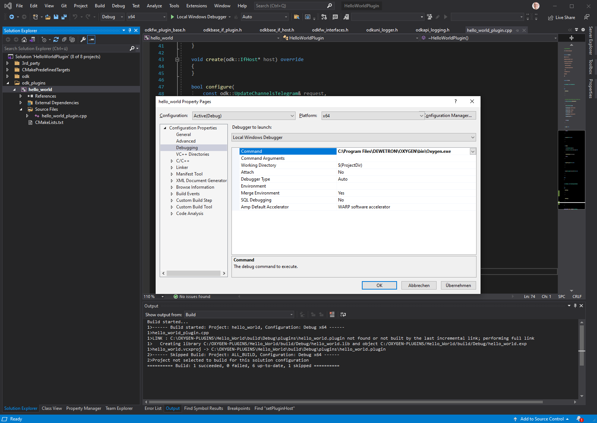
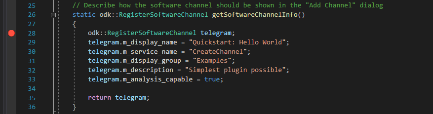
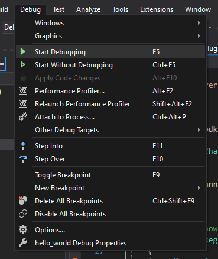
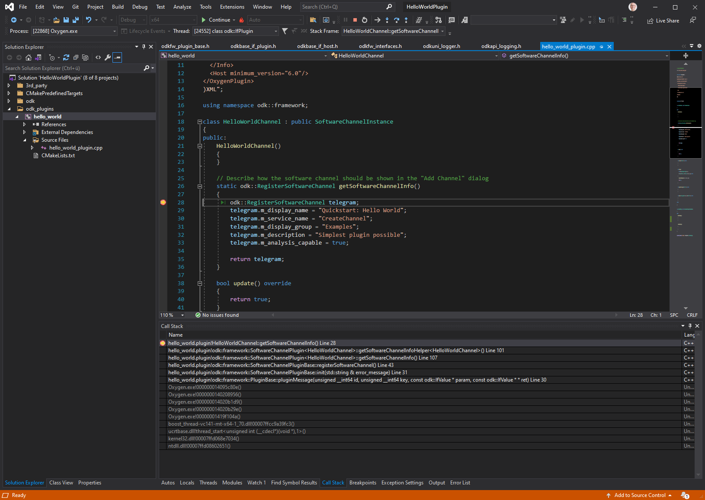
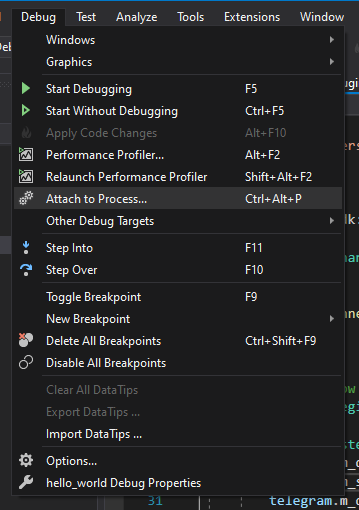
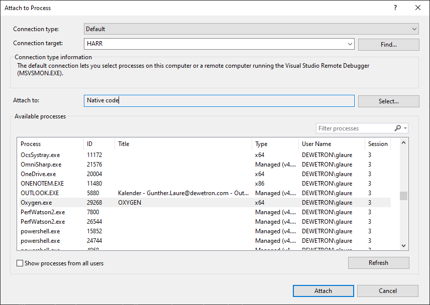

Debugging and Logging
=====================

During development both *Debugging* and  *Logging* are essential.
This chapter describes how both con be used when developing Oxygen plugins.

Debugging from Visual Studio
----------------------------

Let the debugger start Oxygen
~~~~~~~~~~~~~~~~~~~~~~~~~~~~~

One way to debug the plugin from the initiation phase on is by starting
Oxygen by Visual Studio.

For this the configuration has to be changed a little:

Change the *Command* from *$(TargetPath)* to the Oxygen.exe path:

    Debugger Settings.

Set a breakpoint to test if debugging works. We set it in the method
*getSoftwareChannelinfo()* which is always called on plugin instantiation.

    Setting a breakpoint.

Now start the debugger by pressing the key *F5* or by selecting *Start Debugging*
in the *Debug* menu.

    Starting the debugger.

Oxygen will start and after a few seconds the execution will stop at the breakpoint.

    Debugging breakpoint hit.

Voila!

Attach the debugger to Oxygen 
~~~~~~~~~~~~~~~~~~~~~~~~~~~~~

Alternatively it is possible to attach a debugger to a running Oxygen 
process.

The following step-by-step guide explains how to attach a Visual Studio
debugger to a running Oxygen instance in order to debug an ODK plugin
on a developer machine.

Make sure the latest build of your plugin is copied to a suitable
plugin location (see previous section). Usually, copying the
``.plugin`` file is sufficient and the ``.pdb`` does not need to be copied.

Start Oxygen and make sure your plugin is loaded.

In Visual Studio, open the debug attach dialog from 'Debug' -> 'Attach to Process...'

    Attach to Process.

Make sure that the value of 'Attach to:' is set to 'Native code' and not 'Automatic'

Select 'Oxygen.exe' in the process list

    Attaching to Oxygen.

Close the dialog by clicking on the 'Attach' button

Now, set your breakpoints and use the plugin inside Oxygen until it triggers a
breakpoint.

Logging
-------

Logging is still work in progress.
