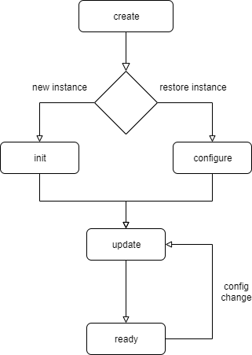
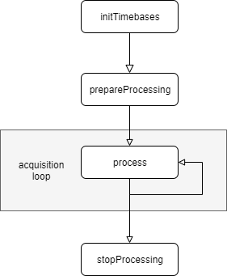

------------------------
Software Channel Plugins
------------------------

SoftwareChannelPlugin is a framework support class including several helpers used to simplify read, process and/or write channel data from/to Oxygen.
At runtime, depending on the current Oxygen setup, there can be multiple instances of one SoftwareChannelPlugin active, each acting independently.

From a user perspective, an instance is created using the AddChannel Dialog ('+' button) in the Oxygen channellist.

Possible use cases are, for example:
    - Read channel data from Oxygen and forward them to an external interface
    - Provide channels with simulated data read from a text file
    - Process channel data from Oxygen in an custom calculation and write back the results as channels

```````````````
Output Channels
```````````````

A SoftwareChannelPlugin instance can provide 1 to n output channels which are then available in Oxygen.
One root channel of the instance is automatically added by the framework to act as an anchor point for the instance.
Additional channels can be added as children of the root channel as needed.
Output channels can provide configuration parameters and sample data in various formats.
See :ref:`Data Format <channel_data_format>`
By default, the root channel does not act as a data channel providing samples but can be configured to do so like every other output channel.


`````````````
Configuration
`````````````

Configuration parameters can be added to every output channel, including the root channel.
These configuration parameters are automatically available in Oxygen and get stored in the Oxygen setup file.

See :doc:`Oxygen Channel Configuration <channel_configuration>`

``````````````
Input Channels
``````````````

To request channels as input channels and fetch data from them, the channel id of the desired channel has to be contained in a
ChannelID (for single channel) or ChannelIDList (for multiple channels) config item.
This channels will get fetched automatically and data will be provided in the process() call.

Additionally, in case of a config change of one of the input channels, the instance will get the opportunity to react in an update() call.

`````````````````````````````````
SoftwareChannelInstance Lifecycle 
`````````````````````````````````




create
    Called once on creation of the instance as first entry point.
    This can be triggered either by creating via GUI or by loading an Oxygen config file containing a software channel instance.

    All static configuration should happen in here.

    E.g.: 
    - If the plugin provides 2 output channels, regardless of configuration and input, they should be configured here.

init
    Called after creation over GUI and used to set up the instance based on the user selected input channels.

configure
    Called after creation on setup load. A complete set of the stored parameters is provided to restore the state of the instance.
    There are some helper functions available to extract channel and config parameters and apply them.

    When loading a setup the framework will call updatePropertyTypes() for each loaded plugin output channel.
    Due to ambiguity in regard to ODK property types the framework loads properties with a placeholder type and the 
    plugin is responsible to exchange this placeholder with the property data type it expects to work with.

    As property-constraints are not serialized to the setup file, all static constraints need to be re-established after loading.
    The framework will call the function updateStaticPropertyConstraints() for each plugin ouput channel.
    More dynamic constraints need to be handled during update().


update
    called every time a configuration parameter of the instance or an input channel changes.
    Should be used to update the dynamic state of the instance:

    - update config parameters
    - update config constraints
    - add/remove/update output channels depending on configuration

    e.g.: input channel unit has changed, adapt unit of output channel

```````````````
Data processing
```````````````
If a SoftwareChannelInstance is configured and valid, it takes part in the Oxygen acquisition loop.



initTimebases
    Called once per acquisition run when all input channel timebases are ready and used to determine the timebases of the output channels

prepareProcessing
    Called once per acquisition run, used to set up the instance for processing (create buffers, ...)

process
    Called periodically as long as the acquisition is running.
    Adding samples to output channels must be done in here.
    ProcessingContext provides current time information and all new data of the requested input channels since the last call.

stopProcessing
    Called once per acquisition run, used to clean up the instance